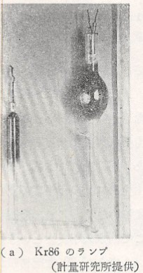

# 長さの単位

　長さはもともと点の相対的位置を表すための量で、二つの長さはこれらを重ね合わせることによって直感的にその大きさを判定することができる。長さがあらゆる物理量の中での最も基礎的なものになっている理由はここにある。そして他の物理量も、これを正確に知るためには長さの測定によることが非常に多い。例えば、時間は時計の針の動いた距離で、物体の重さははかりの目盛りで温度は水銀柱の長さで測るなどがこれである。

　長さの単位として物理学で用いられているものはメートルであるが、このメートルが最初測定されたのはフランスで1795年のことである。そして地球子午線の全長の4000万分の1の長さをもって単位とするというのが最初の考えであった。これにしたがって子午線の実測を行い、その後、幾多の経緯を経た後に1875年に至って初めて国際的にメートル条約ができ、メートル原器というものが制定された。このメートル原器は特殊の切り口（これは曲がりにくくするため）をもち、白金90％、イリジウム10％の合金で作られた棒で、その両端に近いところそれぞれ細い標線がある。0℃におけるこの標線間の長さが1m と決められた。この国際原器はパリ郊外の国際度量衡局に保管され、各国はこれとほとんど同じもの（副原器）を保管することとなった。それぞれ多少の誤差は免れ難く、我が国に配布されたものでは、標線間の長さは

\\[
    1{\rm m}-\left(1.3-8.667t-0.00100t^2 \right)\mu
\\]

であった。ただし \\( t \\) は温度（℃）を、\\( \mu \\) はミクロン（micron）で \\( 10^{-6} \\) m である。

　このようにして決定されたメートル原器にもいろいろ難点がある・まず第１は永久不変性の問題で、人工的なものである以上、破損の危険がないとは言えないし、またこのような合金製のものが長年月の間にひとりでに変形しないとは保証できない。しかもそれ以上の欠点とされるのは精度である。原器の両端にある標線は細い線であるが、それでも幅が \\( 6~8\mu \\) 程度である。そこで両線の中心を採ったとしても全長に \\( 0.2\mu \\) 程度の誤差は免れ得ない。すなわち、相対誤差 \\( 2\times 10^{-7} \\) の精度しかなく、これでは進歩した現代の精密科学の要求を満足してくれない。そこで、永久不変性という意味で、ある決まった光の波長を長さの基準にするという考えが20世紀初頭からあった。そして、 Cd 蒸気中における放電の場合に発する赤色光をこのために用いるという提案がなされたこともある。

光の波長を基準にするというのは

"外から何らかの影響を受けていない静止した同一種の原子の出す光の波長は定まっている"[^note1]

という考えに基づくものである。しかし現実には、元素が同位体の集合であって、完全に同一種の原子の集合でないこと、原子同士が互いに影響しあっていること、これを光らせるために電気的影響を受けていること、原子が前後左右に振動しているために、その発する光が例え一定でもDoppler効果によって異なった波長の光の混合として観測されること、などその他いろいろの理由で純粋に波長が一定した光というものが得られなかった。

　その後の研究によって\\( {}^{86}\rm{K} \\)[^note2]という同位体が分離されるようになり、理想に近い光が得られるようになった。そして1960年10月14日の国際度量衡総会で、今後長さの単位として\\( {}^{86}\rm{K} \\)の発するKr66橙色線の波長を用いることが決定され、わが国でも1961年7月1日からこれによるということが政令で決められた。

以下の図はこの\\( {}^{86}\rm{K} \\)

[^note1]:数個の飛び飛びの波長の光の混合でるから、その中の一つを選ぶ。

[^note2]:もともとKrの中には質量数、78、80、82、83、84、86の同位体が含まれている。